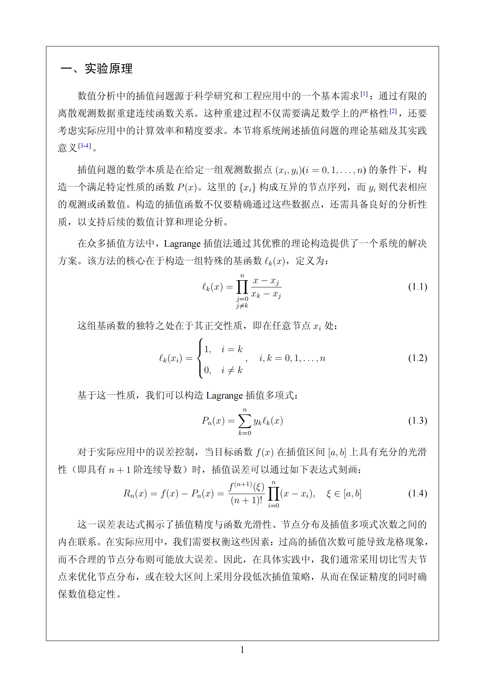
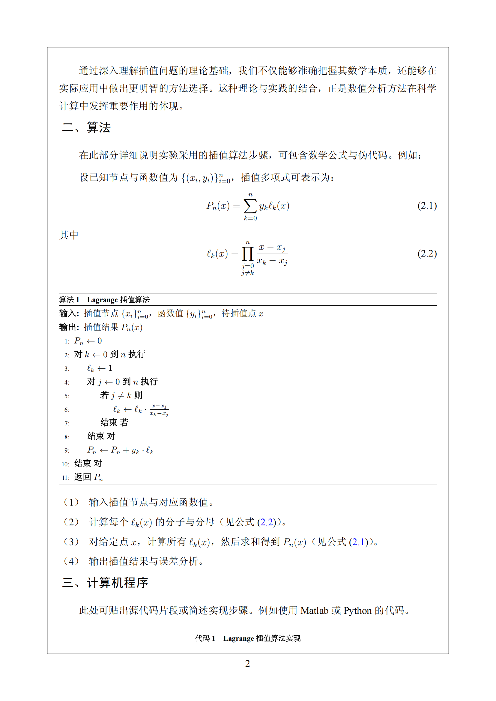
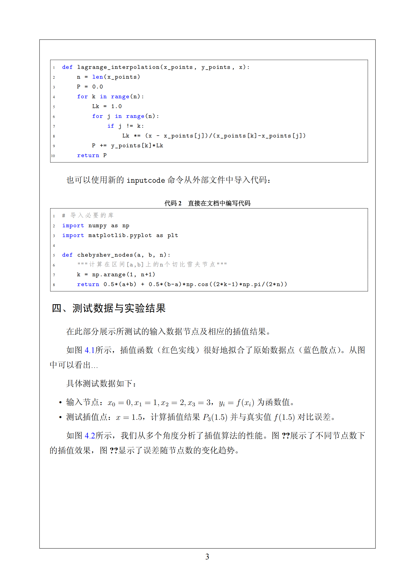

# 江苏海洋大学实验报告模板

简体中文 | [English](README.md)

一个专业的江苏海洋大学实验报告LaTeX模板，支持双语，具有自定义格式和全面的学术文档元素。

## 模板预览

### 封面页
<div align="center">
  
</div>

### 数学公式与理论
<div align="center">
  
</div>

### 算法描述
<div align="center">
  
</div>

### 代码实现
<div align="center">
  
</div>

### 数据分析与可视化
<div align="center">
  
</div>

### 误差分析与表格
<div align="center">
  
</div>

### 结论与参考文献
<div align="center">
  
</div>

## 特性

- 双语支持（中文/英文）及恰当的字体处理
- 专业的标题页布局，包含大学品牌元素
  - 学期代码显示（学年和学期编号）
  - 可选的第二行实验名称
- 中文章节编号与恰当的格式
- 集成的图片、表格和公式管理
- 支持中文GB/T 7714标准的参考文献
- 自定义页眉页脚设计，包含特殊的首页格式
- 全面的数学和算法支持
- 自动页面框架和页码
- 附录支持，使用字母章节编号
- 中文列表环境，具有正确的格式
- 支持外部代码文件包含

## 环境要求

- XeLaTeX编译器 & Overleaf
- 所需字体：
  - SimSun.ttf (宋体)
  - SimHei.ttf (黑体)
  - SimHei-Bold.ttf (黑体加粗)
  - STXINWEI.ttf (华文新魏)
  - Times New Roman

## 安装

### Overleaf (推荐)
1. 在Overleaf中创建新项目
2. 上传`joulabreprot.cls`到项目根目录
3. 创建名为`font`的新文件夹并上传所需的中文字体
4. 使用模板结构创建你的主`.tex`文件
5. 选择XeLaTeX作为编译器

### 本地安装
1. 克隆此仓库
2. 将`joulabreprot.cls`放入TeX发行版的本地texmf树中
3. 确保所需的字体已安装在系统上
4. 使用启用shell-escape选项的XeLaTeX编译：
   ```
   xelatex -shell-escape main.tex
   ```

## 使用方法

基本模板特性包括：

1. 文档结构
```latex
\documentclass{joulabreport}

% 标题页信息
\coursename{数值分析A}
\expname{插值法实验}            % 必填 - 实验名称
\expnametwo{理论与数值计算分析}  % 可选 - 实验名称第二行
\classname{信嵌1221}
\author{姓名}
\studentid{学号}
\thisdate{2024/12/9}
\location{定海楼602}
\teacher{教师姓名}
\semesteryear{2024}         % 学年第一年
\semesteryeartwo{2025}      % 学年第二年
\semesternumber{2}          % 学期编号（1或2）

\begin{document}
\maketitle

\section{实验原理}
% 内容...

% 在文档末尾可以包含附录
\appendix
\section{附录A：补充材料}
% 附录内容...

\end{document}
```

2. 数学公式
```latex
\begin{equation}
P_n(x) = \sum_{k=0}^n y_k\ell_k(x)
\end{equation}
```

3. 算法
```latex
\begin{algorithm}[htbp]
\caption{算法名称}
\begin{algorithmic}[1]
\Require 输入
\Ensure 输出
% 算法步骤...
\end{algorithmic}
\end{algorithm}
```

4. 代码列表
```latex
\begin{lstlisting}[language=Python, caption=代码说明]
def example_function():
    pass
\end{lstlisting}

% 包含外部代码文件
\inputcode[Python]{path/to/code.py}
```

5. 表格
```latex
\begin{table}[htbp]
\centering
\caption{表格标题}
\begin{tabular}{ccc}
\toprule[1.5pt]
列1 & 列2 & 列3 \\
\midrule[0.75pt]
数据 & 数据 & 数据 \\
\bottomrule[1.5pt]
\end{tabular}
\end{table}
```

6. 中文编号
```latex
% 带括号的中文风格编号列表
\begin{cnumerate}
\item 第一项
\item 第二项
\end{cnumerate}

% 行内中文风格编号
\citem{1} 第一项
```

7. 参考文献
```latex
\begin{thebibliography}{4}
\bibitem{ref1} 作者. 标题[M]. 出版社, 年份.
\end{thebibliography}
```

## 可用的字体大小

模板提供了几种中文字体大小命令：
- `\chuhao`: 42pt (初号)
- `\xiaochuhao`: 36pt (小初)
- `\yichuhao`: 32pt (一号)
- `\erhao`: 22pt (二号)
- `\xiaoer`: 18pt (小二)
- `\sanhao`: 16pt (三号)
- `\xiaosan`: 15pt (小三)
- `\sihao`: 14pt (四号)
- `\xiaosi`: 12pt (小四)
- `\wuhao`: 10.5pt (五号)
- `\xiaowu`: 9pt (小五)

## 许可证

本模板基于MIT许可证发布。

## 作者

- **Tseka Luk** 

## 贡献

欢迎提出问题和拉取请求。对于重大更改，请先开一个问题来讨论你想要改变的内容。

## 致谢

- 江苏海洋大学
- 理学院信息与计算科学系 