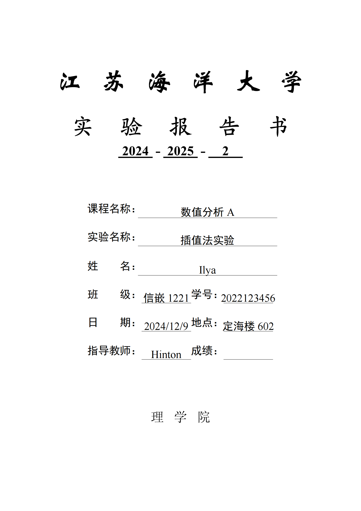
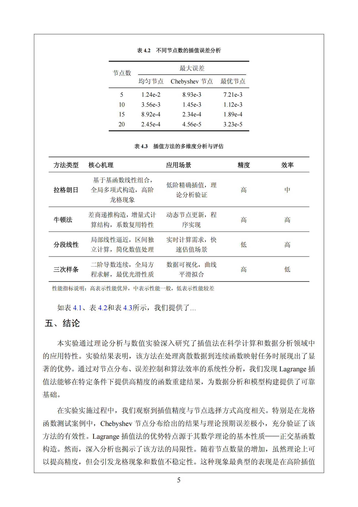
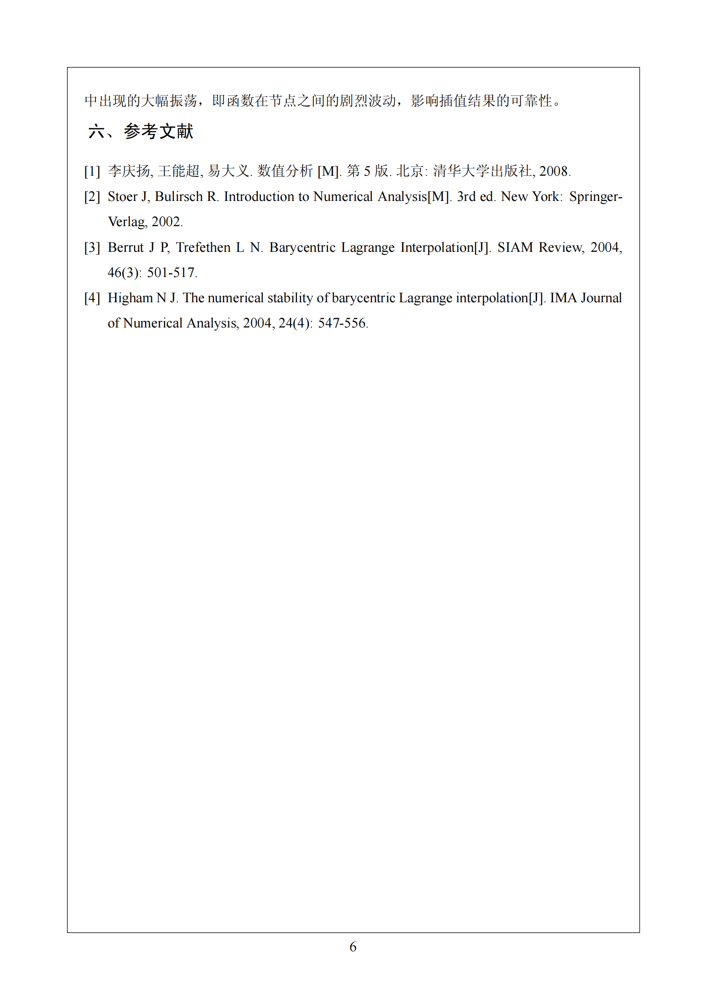

# Jiangsu Ocean University Lab Report Template

[简体中文](README.CN.md) | English

A professional LaTeX template for laboratory reports at Jiangsu Ocean University, featuring bilingual support, custom formatting, and comprehensive academic document elements.

## Template Preview

### Cover Page
<div align="center">
  
</div>

### Mathematical Equations and Theory
<div align="center">
  
</div>

### Algorithm Description
<div align="center">
  
</div>

### Code Implementation
<div align="center">
  
</div>

### Data Analysis and Visualization
<div align="center">
  
</div>

### Error Analysis and Tables
<div align="center">
  
</div>

### Conclusion and References
<div align="center">
  
</div>

## Features

- Bilingual support (Chinese/English) with proper font handling
- Professional title page layout with university branding
  - Semester code display (academic year and semester number)
  - Optional second line for experiment name
- Chinese section numbering with proper formatting
- Integrated figure, table, and equation management
- Bibliography support with Chinese GB/T 7714 standard
- Custom header/footer designs with special first-page formatting
- Comprehensive math and algorithm support
- Automatic page framing and numbering
- Appendix support with alphabetical section numbering
- Chinese enumeration environments with proper formatting
- Support for external code file inclusion

## Requirements

- XeLaTeX compiler & Overleaf
- Required fonts:
  - SimSun.ttf (宋体)
  - SimHei.ttf (黑体)
  - SimHei-Bold.ttf (黑体加粗)
  - STXINWEI.ttf (华文新魏)
  - Times New Roman

## Installation

### Overleaf (Recommended)
1. Create a new project in Overleaf
2. Upload `joulabreprot.cls` to the project root
3. Create a new folder named `font` and upload required Chinese fonts
4. Create your main `.tex` file using the template structure
5. Select XeLaTeX as the compiler

### Local Installation
1. Clone this repository
2. Place `joulabreprot.cls` in your TeX distribution's local texmf tree
3. Ensure required fonts are installed on your system
4. Compile using XeLaTeX with the shell-escape option enabled:
   ```
   xelatex -shell-escape main.tex
   ```

## Usage

Essential template features include:

1. Document Structure
```latex
\documentclass{joulabreport}

% Title page information
\coursename{数值分析A}
\expname{插值法实验}            % Required
\expnametwo{理论与数值计算分析}  % Optional - Second line of experiment name
\classname{信嵌1221}
\author{姓名}
\studentid{学号}
\thisdate{2024/12/9}
\location{定海楼602}
\teacher{教师姓名}
\semesteryear{2024}         % First year of the academic year
\semesteryeartwo{2025}      % Second year of the academic year
\semesternumber{2}          % Semester number (1 or 2)

\begin{document}
\maketitle

\section{实验原理}
% Content...

% At the end of your document, you can include an appendix
\appendix
\section{附录A：补充材料}
% Appendix content...

\end{document}
```

2. Mathematical Equations
```latex
\begin{equation}
P_n(x) = \sum_{k=0}^n y_k\ell_k(x)
\end{equation}
```

3. Algorithms
```latex
\begin{algorithm}[htbp]
\caption{算法名称}
\begin{algorithmic}[1]
\Require 输入
\Ensure 输出
% Algorithm steps...
\end{algorithmic}
\end{algorithm}
```

4. Code Listings
```latex
\begin{lstlisting}[language=Python, caption=代码说明]
def example_function():
    pass
\end{lstlisting}

% Including code from external file
\inputcode[Python]{path/to/code.py}
```

5. Tables
```latex
\begin{table}[htbp]
\centering
\caption{表格标题}
\begin{tabular}{ccc}
\toprule[1.5pt]
列1 & 列2 & 列3 \\
\midrule[0.75pt]
数据 & 数据 & 数据 \\
\bottomrule[1.5pt]
\end{tabular}
\end{table}
```

6. Chinese Enumeration
```latex
% Chinese-style numbered list with parentheses
\begin{cnumerate}
\item 第一项
\item 第二项
\end{cnumerate}

% Inline Chinese-style numbering
\citem{1} 第一项
```

7. References
```latex
\begin{thebibliography}{4}
\bibitem{ref1} 作者. 标题[M]. 出版社, 年份.
\end{thebibliography}
```

## Available Font Sizes

The template provides several Chinese font size commands:
- `\chuhao`: 42pt (初号)
- `\xiaochuhao`: 36pt (小初)
- `\yichuhao`: 32pt (一号)
- `\erhao`: 22pt (二号)
- `\xiaoer`: 18pt (小二)
- `\sanhao`: 16pt (三号)
- `\xiaosan`: 15pt (小三)
- `\sihao`: 14pt (四号)
- `\xiaosi`: 12pt (小四)
- `\wuhao`: 10.5pt (五号)
- `\xiaowu`: 9pt (小五)

## License

This template is released under the MIT License.

## Author

- **Tseka Luk** 

## Contributing

Issues and pull requests are welcome. For major changes, please open an issue first to discuss what you would like to change.

## Acknowledgments

- Jiangsu Ocean University
- Department of Information and Computing Science, School of Science